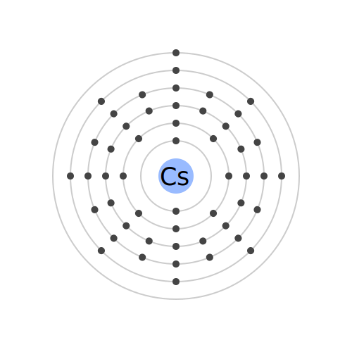

# Caesium



A static application generator which creates a [React] application and passes all the props to you. Allows you to create a site search and other dynamic pages from your site as if it had a database.

Caesium is in early development and is not ready for production use.

## Development

To use caesium in the test site (or from source in any site) npm install its folder e.g.

```shell
npm install ../../ --save
```

[React]: https://facebook.github.io/react/
